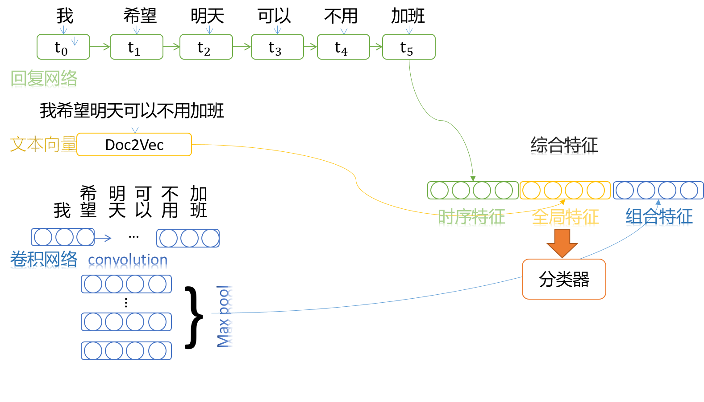
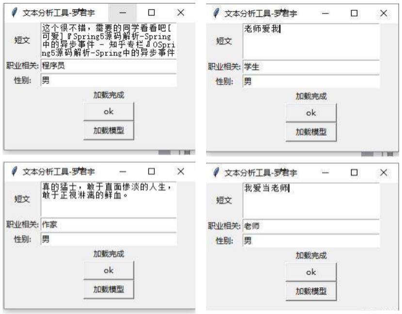

# Tensorflow Chinese Twitter(微博) Author Info Analysis System
## Motivation
It's very easy for a man with proper common sense and social experience to guess a speaker's social backgrounds according to its' dialogue.
If machine can do the same thing it should be very interesting and has a potential commercial value. So design and trained this system based on the data collected by a web spider. 
## Method
### Hybrid bone network
RNN CNN, Doc2vec three approaches are used to extract embedding vector of a short text. And final a neural classifier is applied to give out the prediction.

## How to use it
Requirement:
1. tensorflow
2. jieba
3. tinker
4. gensim  
Download additional data from [here](https://drive.google.com/file/d/1Ed0gPxhszyV6AmvVm15jsWMRkYVaOswC/view?usp=sharing) and unzip them into the branch. 
run ana.py to activate the program. 
Click "加载模型" to load the trained model. 
Put your text into the chat box and click "ok" to analysis it.

